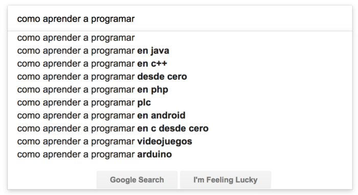

### Aprender a programar 

 
El los últimos meses me han fomulado en varias ocasiones la pregunta de “¿Cómo aprender a programar?” o “¿Qué recomiendo para aprender a programar?”. Principalmente la pregunta viene de estudiantes de alguna carrera relacionada con el desarrollo de software y en menor cantidad de personas que les gustaría aprender aún sin tener una formación en el área.

## Quiero aprender

Lo primero que tienes que saber si es que ya decisdiste que quieres aprender a programar, es que no hay atajos, no hay curso o libro que en algunas horas o días te vayan a enseñar todo lo que necesitas saber para dedicarte a esta actividad.

Para dedicarte al desarrollo de software se requiere de constancia, disciplina y perseverancia. Es necesario realizar un inversión de tiempo importante para adquirir práctica que te ayuden a desarrollar habilidades técnicas, intuición y experiencia en general.

> La repetición es importante.

Aún cuando es posible aprender por tu cuenta, siempre va a ser mejor si puedes aprender con alguien más, ya sea con otra persona que está aprendiendo como tú o qué mejor que aprender con alguién que ya tiene experiencia.

La colaboración y comunicación son las herramientas más importantes en el desarrollo de software, inclusive más importantes que escribir código. Son actividades efectivas para acelerar el proceso de aprendizaje y para verificar y corregir suposiciones, además del valor implícito de aprender cosas nuevas.
A lo anterior hay que sumarle que la cantidad de información, opiniones encontradas, nuevas herramientas, nuevas tecnologías se generan de manera muy rápida, en ocasiones puede ser abrumador discernir que tiene valor o utilidad para nosotros. Tal situación puede causar ansiedad de querer abarcar todo, pero eso nos haría perder el enfoque en lo que vamos a aprender.

## Aprender

Ya con la desición de que sí queremos aprender a programar llega el momento de elegir el lenguaje de programación.

No hay una respuesta simple aquí. Depende a quien le preguntes, es la respuesta que obtendrás y generalmente vendrá acompañada de razones del porqué aprender ese lenguaje de programación será tu mejor opción, mientras desestiman otros lenguajes de programación porque: Ya son muy antiguos, Ya no son populares, Nadie los usa, No son el futuro.

Personalmente aprendí a programar con [GW-Basic](https://en.wikipedia.org/wiki/GW-BASIC) y [Pascal](https://en.wikipedia.org/wiki/Pascal_%28programming_language%29) ambos en el paradigma de programación estructurada y basados en lenguajes previos como Basic y Algol 60. Posteriormente por necesidad tuve que aprender a programar en Ensablador para X86 y C.

En esas épocas no existía tan marcado el concepto del lenguaje cool o de moda, aprendias por diversión o por necesidad. Pasé también por una serie de lenguajes obscuros y enfocados a Mainframe como CSP, JCL y Cobol antes de tocar mi primer languaje orientado a objetos.

El haber iniciado mi aprendizaje con un par de lenguajes que no tenian aplicación práctica ni se parecian en nada a los lenguajes actuales no los siento como una desventaja o que me hayan restado mis habilidades y/o conocimiento como desarrollador, por lo que el languaje que elijas tampoco lo hará en ti.

Tu primer lenguaje de programación más allá de aprender la sintaxis debe de ayudarte a entender como funcionan los programas de software en términos generales. Te ayudará a conocer y sentirte familiar con las herramientas necesarias para trabajar con él. Te expondrá a la comunidad que hay detrás de él. En general obtendrás experiencia que te ayudaran a formar tu propia opinión sobre él y salto al siguiente lenguaje.

Para facilitar la decisión de tu primer lenguaje de programación te dejo las siguientes preguntas:

1. ¿Qué tipo de aplicaciones te interesa desarrollar? ¿Móviles, Web (Backend/Frontend), de Escritorio, aplicación científica, videojuegos, otras?

1. ¿Hay alguna comunidad donde vives del lenguaje o conocer a otras personas que lo usen y de quienes puedas aprender? ¿Hay suficientes recursos para encontrar material e información?

1. ¿Te interesa encontrar un trabajo? ¿Qué lenguajes usan en las empresas donde te gustaría aplicar?

Si aún no tienes claro qué lenguaje, déjame hacerte una sugerencia: Ruby

#### Ruby

Soy Rubista, primeramente porque me gusta el lenguaje Ruby, además de que disfruto trabajar con él, y en segundo lugar porque es el lenguaje con el que ayudamos a nuestros clientes.

Ruby no es el lenguaje de programación que estoy obligado a utilizar día con día, es el lenguaje de programación que yo 
he elijido para trabajar.

[https://twitter.com/tenderlove/status/918286864255090689](https://twitter.com/tenderlove/status/918286864255090689)

## Recursos para aprender

Si te interesa aprender a programar en un lenguaje como Ruby te dejo los siguientes recursos, los cuales te ayudaran a obtener las bases del languaje, pero también te ayudan a crear algunos fundamentos generales en el área de desarrollo de software.

### Herramientas

1. Command Line [https://launchschool.com/books/command_line/read/introduction](https://launchschool.com/books/command_line/read/introduction)

1. Git and Github [ https://launchschool.com/books/git/read/introduction](https://launchschool.com/books/git/read/introduction)

### Ruby

1. Introducción a Ruby, el lenguaje de los programadores felices [http://www.railsenespanol.co/capitulos/capitulo1](http://www.railsenespanol.co/capitulos/capitulo1)

1. Learn to program [https://pine.fm/LearnToProgram](https://pine.fm/LearnToProgram)

1. Introduction to Ruby [https://launchschool.com/books/ruby/read/introduction](https://launchschool.com/books/ruby/read/introduction)

1. Core Ruby tools [https://launchschool.com/books/corerubytools/read/introduction](https://launchschool.com/books/corerubytools/read/introduction)

1. Ruby Warrior [https://github.com/ryanb/ruby-warrior](https://github.com/ryanb/ruby-warrior)

1. Ruby Koans [http://www.rubykoans.com](http://www.rubykoans.com)

### Fundamentos

1. Object Oriented Programming [https://launchschool.com/books/oo_ruby/read/introduction](https://launchschool.com/books/oo_ruby/read/introduction)

1. Regular expressions [https://launchschool.com/books/regex/read/introduction]( https://launchschool.com/books/regex/read/introduction)

1. Data Structures [http://www.studytonight.com/data-structures/introduction-to-data-structures](http://www.studytonight.com/data-structures/introduction-to-data-structures)

### Base de datos

1. SQL [https://launchschool.com/books/sql/read/introduction](https://launchschool.com/books/sql/read/introduction)

1. PostgreSQL Tutorial [http://www.postgresqltutorial.com](http://www.postgresqltutorial.com)

### Web
1. Introduction to HTTP [https://launchschool.com/books/http/read/introduction](https://launchschool.com/books/http/read/introduction)

1. Learn HTML & CSS [https://learn.shayhowe.com/html-css/](https://learn.shayhowe.com/html-css/)

1. Advanced Learn HTML & CSS [https://learn.shayhowe.com/advanced-html-css/](https://learn.shayhowe.com/advanced-html-css/)

1. CSS Layout [http://learnlayout.com](http://learnlayout.com)

1. Visual Guide to Flexbox [https://scotch.io/tutorials/a-visual-guide-to-css3-flexbox-properties](https://scotch.io/tutorials/a-visual-guide-to-css3-flexbox-properties)

1. Introductions to Javascript [https://developer.mozilla.org/en-US/docs/Web/JavaScript/Guide/Introduction](https://developer.mozilla.org/en-US/docs/Web/JavaScript/Guide/Introduction)

1. The modern Javascript tutorial [http://javascript.info](http://javascript.info)

1. Working with Web APIs [https://launchschool.com/books/workingwithapis/read/introduction](https://launchschool.com/books/workingwithapis/read/introduction)

1. Desmistifying Rails [ https://launchschool.com/books/demystifying_rails/read/introduction](https://launchschool.com/books/demystifying_rails/read/introduction)

1. Ruby on Rails, el desarrollo ágil de aplicaciones web [http://www.railsenespanol.co/capitulos/capitulo2](http://www.railsenespanol.co/capitulos/capitulo2)

1. Getting started with Rails [http://guides.rubyonrails.org/getting_started.html](http://guides.rubyonrails.org/getting_started.html)

## Conclusiones

Espero que la información y recursos presentados te sean de utilidad al momento de considerar apreder a programar. Recuerda que los recursos listados no son la única guía, pero sí son una base para iniciar en este camino.
